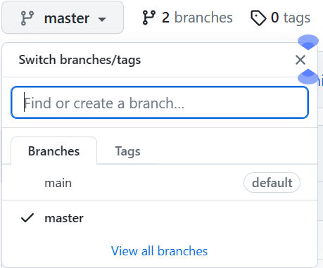
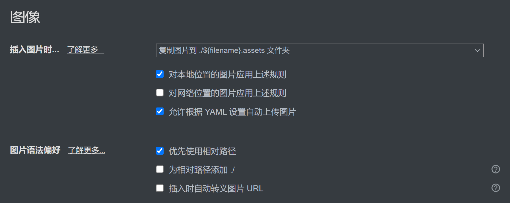

# 第一次例会

[toc]

---

## git

#### 第一次上传

我们用的是master分支，因为更加方便，需要在这里改branch才能看到上传的内容



也可以直接设置默认分支为master,点用户头像——>setting——>reposistors->default branch更改成master

在文件夹中使用git bash here打开git

git init对git进行初始化

git remote add origin 后面加上你的git仓库的地址

git add .代表添加所有文件到暂存区里

使用git status可以看到添加到暂存区里的文件信息

git add test.txt代表添加test.txt文件

git commit -m “test”

test是一种备注，在github提交的文件旁可见,也就是本次提交的说明，可以输入任意内容，当然最好是有意义的，这样你就能从历史记录里方便地找到改动记录

git commit 就准备将暂存区里的内容提交到代码仓库里了

然后git push origin master

git push origin master -f强制上传并且覆盖，当出现了意外的错误时可以试试，但是之前上传的内容会被覆盖

#### 删除文件

删除文件用git rm -r 4-meeting

然后git commit -m "delete 4-meeting"

最后git push orgin master

#### 再次上传

成功上传一次后再上传只需要

git add-> git commit -> git push origin master

#### 查看commit记录

git log

#### 协作

如果有别人更新仓库，需要先git pull把别人更新的内容拉下来才能继续上传自己的内容

git clone 后面是仓库地址，可以把所有仓库内容clone下来

任务一：上传一个名为first_commit的文件夹，文件夹中有一个名为first_commit.md的文件，里面的内容是Hello World

任务二：上传一个名为delete_test的文件夹，文件夹中有一个名为delete_test.md的文件，里面无需内容，然后使用rm删除该文件，更新github上的内容

任务三：将github上git@github.com:qianyeyue/meeting-QC.git的内容clone下来

---

## Markdown

使用Typora进行笔记的记录

#### 一些快捷键

ctrl+n新建文件

侧边栏显示 shift+ctrl+L，也是大纲和文件列表显示的地方

ctrl+shift+2显示文件以及其更新时间  ~~可能没什么用？~~

查找文件 ctrl+P

ctrl+f 通过关键字查找

[toc]用来弄目录，其实就是大纲换一个地方

---表示分割线

---

不同标题形式的展现

# ctrl+1 一级标题

## ctrl+2 二级标题

### ctrl+3 三级标题

以此类推

**这是高亮** ctrl+b

~~这是删除线~~ 删除线把两个 ~ 之间的字画上删除线~~ ~~  ~~说实在用处其实不太大~~

~~12311~~

shift+ctrl+m表示数学公式
$$
a^2   H_2O
$$
代码块 shift+ctrl+k

\

```python

```

python

```python
print("hello world");
```

C

```c
printf("%d",a);
```

C++

```C++
 cout << "ERROR";
```

shift+ctrl+i 插入图片，需要缩放图片右键图片即可


插入图片时使用相对路径，文件->偏好设置->图像->优先使用相对路径,同时调整插入图片时为复制图片到 ./${filename}.assets文件夹




shift+ctrl+[ 代表插入有序列表

1. 
2. 

shift+ctrl+]代表插入无序列表

- 
- 

ctrl+/ 源代码模式

F8专注模式

F9打字机模式——也就是自动把字对准到屏幕最中央

F11全屏

找适合自己的做笔记模式即可

任务一：将本次例会的内容做成笔记并上传到协同合作的github上，要求笔记形式：

1. 有分割线来分割内容
2. 有目录放在标题下面
3. 有高亮显示的重点
4. 有不同的标题类型

提醒：如果别人更新了仓库，git push前需要用git pull把别人更新的内容pull下来

## 命令行

cd ../表示前往上一级

cd 后面+目录跳转到当前目录

cd \返回根目录

systeminfo显示系统信息

dir列出目录中的项目

ctrl+c 停止执行命令

cls 清除命令行

切换磁盘 D:
